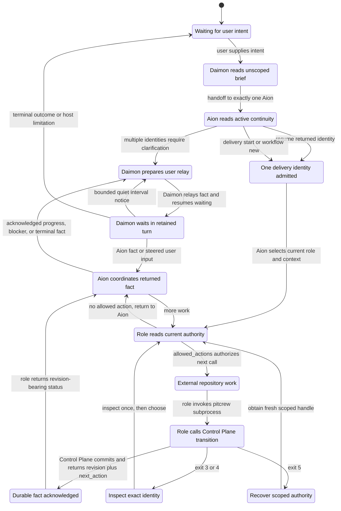
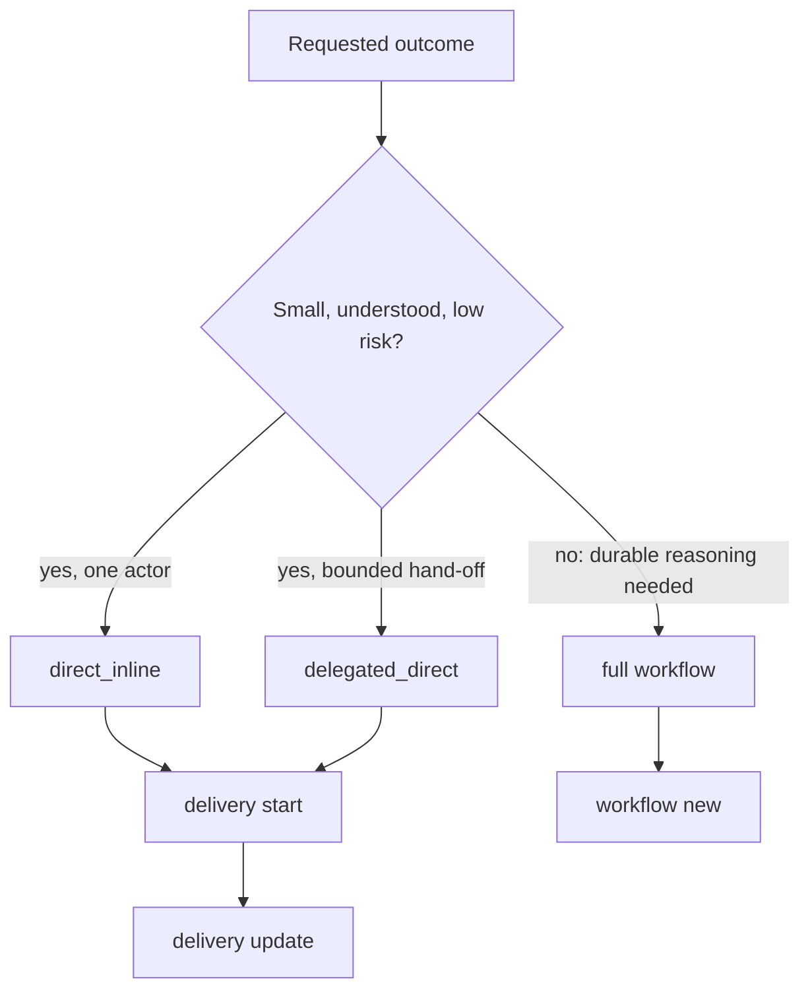
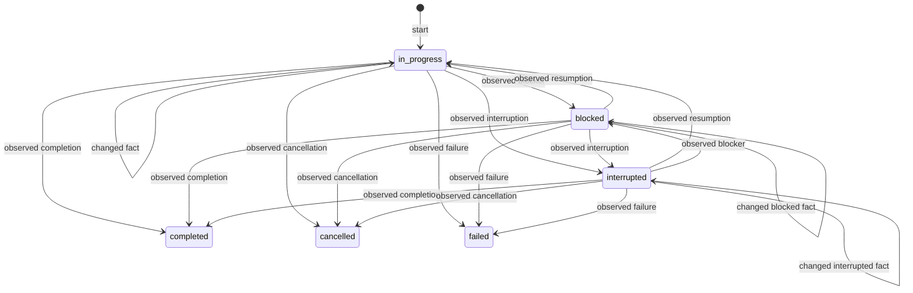

# PitCrew CLI reference

This reference is derived from the public command dispatch, validation, state
machines, and response types in the Go implementation. PitCrew accepts only
long-form flags. Commands that accept structured data read one strict UTF-8 JSON
document from a regular, non-symlink file of at most 4 MiB; unknown JSON fields,
extra documents, missing required flags, duplicate non-repeatable flags, and
blank flag values are rejected.

<!-- cli-docs:navigation:start -->
<a id="choose-a-path"></a>
## Choose a path

- [Install PitCrew agents](#runtime-installation)
- [Read a role brief](#agent-briefs)
- [Understand Control Plane calls](#control-plane-call-flow)
- [Inspect a project](#project-inspection-and-consolidation)
- [Run a direct delivery](#delivery-routing-and-admission)
- [Run a full workflow](#full-workflow-lifecycle)
- [Look up every command](#command-catalog)
<!-- cli-docs:navigation:end -->

## Process contract

Success is one JSON object on stdout:

```json
{"ok":true,"data":{},"warnings":[],"next_action":"..."}
```

Failures are one JSON object on stderr with `ok: false` and an error containing
`code` and `message`. Exit `0` is success, `1` is an internal failure, `2` is
usage, `3` is invalid state, `4` is a compare-and-swap revision conflict, and
`5` is invalid handle authority. Inspect once after exit `3` or `4`; never
blindly replay a mutation. Help and version output are plain text.

| Exit | Classification |
|---|---|
| `0 — ok` | Successful command. |
| `1 — internal` | Internal or I/O failure. |
| `2 — usage` | Invalid command, flag, identifier, or input transport. |
| `3 — state` | Domain precondition or lifecycle state rejected the command. |
| `4 — CAS` | The supplied revision is stale; inspect the identity once. |
| `5 — handle` | Opaque authority is invalid, expired, unsafe, or mismatched. |

<a id="control-plane-call-flow"></a>
## Control Plane call flow

PitCrew is a local subprocess boundary, not an actor or service. The external
agent runtime carries the user conversation and performs handoffs. Agents call
the CLI to read current authority or request a transition; the Control Plane
validates the call, reads or atomically changes durable state, and returns a
revision-bearing result with `next_action`.

<!-- cli-docs:diagram:control-plane-calls:start -->

**Text fallback.** These call states are transient orchestration states, not persisted Control Plane lifecycle states. The user supplies intent to Daimon; Daimon reads its unscoped brief and hands the request to exactly one Aion.
Aion reads active continuity, asks for clarification when several identities match, otherwise resumes or admits one identity, and selects the next role and context.
For direct work, Aion re-reads unscoped continuity; full-workflow specialists read workflow- or unit-scoped authority. The role acts only when `allowed_actions` authorizes the call, invokes the CLI, and returns the revision-bearing result to Aion.
Aion either dispatches more work or returns an acknowledged fact through Daimon. Daimon retains the active user-visible turn while Aion remains active, using host-native mailbox and user steering capabilities.
It relays each meaningful acknowledged fact exactly once, emits one truthful quiet notice no later than five minutes into each continuous quiet interval, forwards steered input as requested state, and resumes waiting.
It finalizes only after distinguishing interruption, cancellation, timeout, failure, blocker, clarification, user-owned gate, completion, or abandonment; it never promises a later unsolicited update after finalizing unless that host supplies a push channel, and missing bounded host liveness is disclosed rather than simulated.
Exit `3` or `4` causes one exact identity inspection; exit `5` requires fresh scoped authority rather than replay.
<!-- cli-docs:diagram:control-plane-calls:end -->

Host capabilities are deliberately not flattened. Codex exposes a bounded mailbox wait that also accepts steered user input, so it can retain the current turn but cannot push after finalization. Pi exposes Aion-to-Daimon `contact_supervisor` progress relays, while its steered user-input dual wait has no stable native trace contract. OpenCode and Claude Code have no repository-verified bounded dual-wait or unsolicited push capability; Daimon must disclose that limitation rather than imply live delivery.

The concrete call boundaries are:

1. Daimon activates with `pitcrew agent brief --role daimon`, then hands the
   accepted intent to exactly one Aion through the external agent runtime.
2. Aion calls `pitcrew agent brief --role aion` to inspect active continuity.
   It resumes the returned identity, asks Daimon to clarify among several, or
   admits exactly one new identity with `delivery start` or `workflow new`
   before repository mutation.
3. Aion or the selected specialist retrieves current authority with
   `pitcrew agent brief --role <role> [--workflow-id <id>] [--unit-id <id>]`.
   The IDs are present only when that role's context contract permits them.
4. The role performs external repository work and invokes only the command in
   `allowed_actions`, supplying the current revision and opaque handle when the
   command requires them.
5. The Control Plane returns the committed revision and `next_action`; a
   specialist returns that revision-bearing status to Aion, and Aion either
   coordinates another call or acknowledges a fact to Daimon for user relay.

Every Control Plane request is a fresh local `pitcrew` subprocess. The Control
Plane never calls a model or agent, chooses a route, or runs repository work.
No role reads or writes `state.db` directly; all durable reads, CAS checks,
handle checks, and transitions cross the CLI boundary.

## Runtime installation

`pitcrew install <codex|opencode|claude|pi>` extracts the embedded installer to
a private temporary directory, runs it for the selected runtime, removes the
extraction, and preserves the installer's exit status. The canonical install
set is nine minimal native role bootstraps. Installation updates agent
integration only; it does not install a support-policy file, the `pitcrew`
executable, another runtime, packages, a daemon, or project state. A prior
managed `pitcrew/agent-contract.md` is removed only when its bytes match a
recognized checksum; modified or non-regular legacy files are preserved and
reported.

The runtime token is exact, lowercase, and alias-free. It overrides
cross-runtime detection and uses only its override or default root:

| Runtime | Override / default root | Native registry | Legacy registry |
|---|---|---|---|
| Codex | `CODEX_HOME` / `~/.codex` | `agents/*.toml` | `prompts/*.md` |
| OpenCode | `OPENCODE_CONFIG_DIR` / `~/.config/opencode` | `agents/*.md` | prior PitCrew entries in `agents/` |
| Claude Code | `CLAUDE_CONFIG_DIR` / `~/.claude` | `agents/*.md` | `prompts/*.md` |
| Pi | `PI_AGENT_HOME` / `~/.pi/agent` | `agents/*.md` | prior PitCrew entries in `agents/` |

The public command transactionally refreshes current PitCrew-managed role
files and warns that custom content must live outside managed definitions.
Unrelated files and application configuration are never rewritten; identical
reruns are write no-ops, and a failed refresh rolls back.

OpenCode requires OpenCode 1.18.23 or newer, `jq`, `timeout`, and an effective
top-level `"subagent_depth": 2` or greater in the target project. Inspect its
resolved configuration with `opencode --pure debug config`. PitCrew validates
the resolved result before target writes and never rewrites user JSON or JSONC.

Pi requires Node.js, an installed and active `pi-subagents` version 0.25.0 or
newer, and `maxSubagentDepth: 3` or greater in
`<pi-agent-home>/extensions/subagent/config.json`. PitCrew validates the exact
package identity and configuration locally; it does not install the extension,
access the network, or modify Pi configuration.

## Agent briefs

`pitcrew agent brief` is the read-only, versioned source of stable role
instructions and bounded current authority. It accepts exactly one supported
`--role`; `--workflow-id` and `--unit-id` are validated for that role before
project inspection, and `--json` selects a standard success envelope instead
of the default text rendering.

Daimon and `pc2-sdd-initializer` accept no context. Aion accepts an optional
workflow ID; without one it receives active-delivery continuity and also works
for an uninitialized project, while a workflow ID selects its coordination
projection. Phase specialists require a workflow ID. `pc2-implementer`
requires workflow and unit IDs. `pc2-reviewer` requires a workflow ID and uses
an optional unit ID to select unit rather than aggregate review context.

Every response is one composite brief in fixed order: a shared operating
contract, the stable role contract, bounded dynamic context when applicable,
and `next_action`. The shared contract carries
`shared_contract.contract_version`, an independently deterministic
`shared_contract.contract_digest`, and the complete canonical embedded
`MAXIMS.md` bytes. The text representation places the same maxims between
`shared_maxims_begin` and `shared_maxims_end` before `role_contract`.

Text and JSON outputs expose the same role `contract_version` and deterministic
`contract_digest`. The role digest covers only the stable role contract; the
shared maxims identity is digested separately, and dynamic context,
`allowed_actions`, and `next_action` change neither digest. Callers must obey
the returned authority rather than infer permission from the stable CLI
surface. Installed native definitions remain minimal and do not duplicate the
maxims; no standalone `MAXIMS.md` is deployed to the runtime.

## Project inspection and consolidation

Run `pitcrew project inspect` before a mutation. Inspection is read-only: it
derives project identity from the canonical Git common directory, reports the
central state and handle paths, and discovers only bounded checkout-local legacy
candidates belonging to that common directory.

When candidates exist, pass a strict manifest to
`pitcrew project consolidate --input-file <path>`:

```json
{
  "project_id": "<64 lowercase hex>",
  "candidate_ids": ["<64 lowercase hex>"],
  "choices": [
    {"workflow_id": "wf-<24 lowercase hex>", "candidate_id": "<64 lowercase hex>"}
  ],
  "retain_existing": ["wf-<24 lowercase hex>"]
}
```

The candidate set must exactly equal the latest inspection. Each duplicate
workflow ID must be assigned at most once to one listed candidate. Consolidation
can explicitly retain a divergent complete graph that already exists in central
state by listing its workflow ID in `retain_existing`; each instruction must
resolve a real central-versus-legacy conflict and cannot overlap `choices`.
Consolidation copies complete workflow graphs atomically. Source databases and WAL files are never deleted or rewritten.

## Delivery routing and admission

<!-- cli-docs:diagram:admission-routing:start -->

**Text fallback.** Direct and delegated-direct work share one delivery trace;
the full route owns the staged aggregate and work units. A direct capability gap
is reported through the surrounding coordinator and never creates a separate persisted state.
<!-- cli-docs:diagram:admission-routing:end -->

`delivery start` accepts `direct_inline` or `delegated_direct`. Its
`operation_key` is idempotent: Identical replay returns the same delivery identity;
reusing the key with different route, goal, reason, or creator is rejected.

The diagram is decision guidance, not a classifier. Aion owns contextual,
qualitative route selection: file count may contribute evidence but does not
determine the route. A stronger route is justified by material risk,
uncertainty, or an assurance need that the simpler route cannot satisfy.

<!-- cli-docs:diagram:direct-delivery:start -->

**Text fallback.** Any non-terminal persisted status may change to any
non-terminal or terminal status. No-change updates are rejected. Completed,
cancelled, and failed deliveries are immutable. Aion continuity first projects
an identity-specific `delivery show`. That inspection records only the exact
revision observed; the next Aion brief then exposes the revision-bound
`delivery update` action. Any successful update advances the revision and
therefore requires a fresh inspection before another mutation. A stale CAS requires one identity-specific inspection with `delivery show` before deciding
what to do, and returns that inspection as recovery. Daimon and specialist
briefs never project direct-delivery mutation authority.
<!-- cli-docs:diagram:direct-delivery:end -->

## Full workflow lifecycle

```mermaid
stateDiagram-v2
    [*] --> draft: workflow new
    draft --> exploring: explore
    exploring --> exploring: explore amendment
    exploring --> specifying: spec
    exploring --> designing: design shortcut
    specifying --> specifying: spec amendment
    specifying --> designing: design
    designing --> designing: design amendment
    designing --> planning: plan
    planning --> plan_approved: approve-plan
    plan_approved --> implementing: begin-implementation
    implementing --> ready_to_complete: last unit completed
    ready_to_complete --> completed: complete approved
    ready_to_complete --> ready_to_complete: complete corrections; persist blocker only
    ready_to_complete --> ready_to_complete: authorize-correction; authority only
    ready_to_complete --> implementing: recover-aggregate; reopen units at next revisions
```

<!-- cli-docs:diagram:aggregate:start -->

**Text fallback.** Every non-terminal aggregate state can transition to `abandoned`.
Completed and abandoned predecessors remain immutable. The operational rule is
`workflow continue --from; predecessor immutable`: the command creates an
independent revision-1 draft child with pinned normative lineage.
A corrections verdict persists only the review and leaves unit revisions unchanged. Only
`recover-aggregate` advances reopened units to their next revisions and returns fresh handles.
<!-- cli-docs:diagram:aggregate:end -->

The normal next-action chain is explore, spec, design, plan, approve-plan,
begin-implementation, list-ready-units, and complete. Amendments are permitted
where shown, and exploration may go directly to design. Operational `progress`
and `request-capability` records increment the aggregate revision without
changing its lifecycle state. `amend-plan` validates its input, but no success
path exists in this control-plane revision because no unforgeable amendment
authority is implemented.

## Work units and opaque authority

```mermaid
stateDiagram-v2
    state "Persisted: pending" as pending
    state "Persisted: reviewing" as reviewing
    state "Persisted: done" as done
    pending --> pending: release-unit-claim; next revision
    pending --> reviewing: unit-tdd with implementation handle
    reviewing --> pending: unit-review corrections; next revision
    reviewing --> reviewing: unit-review approved
    reviewing --> done: unit-complete with implementation handle
    done --> pending: recover-aggregate with fresh authority
```

<!-- cli-docs:diagram:unit-authority:start -->

**Text fallback.** Persisted unit state is only pending, reviewing, or done.
Effective handle/activity status is projected separately. `claim-unit` grants
short-lived implementation authority; `handoff-review` grants review authority
to a different actor. `recover-review` is identity-bound to the original reviewer.
An approved review does not complete a unit: `unit-complete` consumes the
implementation handle. The last unit atomically advances the workflow to `ready_to_complete`.
An owner may use `release-unit-claim` only while the current implementation
handle remains an intent and PitCrew has recorded no implementation evidence,
review, unit verification, or authoritative unit mutation/result activity after
that claim. Inconsistent activity/result projections fail closed. This proves only that the claim is
control-plane-untouched; it does not inspect Git or assert repository cleanliness.
<!-- cli-docs:diagram:unit-authority:end -->

<a id="command-catalog"></a>
## Command catalog

<!-- cli-docs:command-catalog:start -->

### Root and non-workflow commands

| Command | Required or accepted input | Result |
|---|---|---|
| `--help` | none | root help |
| `--version` | none | version text |
| `agent brief` | `--role [--workflow-id] [--unit-id] [--json]` | versioned role contract and bounded authority |
| `install` | runtime name | managed runtime files |
| `project inspect` | none | identity, paths, legacy discovery |
| `project consolidate` | `--input-file` | copied workflow graphs |
| `context inspect` | none | bounded project-context inspection |
| `context initialize` | none | inferred/persisted context bootstrap |
| `context record` | `--actor --input-file` | validated context snapshot |
| `delivery start` | `--actor --input-file` | direct delivery trace |
| `delivery update` | `--delivery-id --revision --actor --input-file` | revised trace |
| `delivery show` | `--delivery-id` | direct or workflow delivery detail |
| `delivery search` | `--query` | matching deliveries |
| `delivery active` | none | active deliveries |
| `tui` | none | read-only terminal cockpit |
| `principles` | optional `--json` | embedded maxims |

### Workflow commands

| Command | Required or accepted input | Main effect |
|---|---|---|
| `workflow new` | `--name --goal --actor` | create draft |
| `workflow continue` | `--from --actor` | create child draft |
| `workflow show` | `--workflow-id [--view] [--unit-id]` | read projection |
| `workflow progress` | `--workflow-id --revision --actor --input-file` | append operational fact |
| `workflow request-capability` | `--workflow-id --revision --actor --input-file` | append capability request |
| `workflow explore` | `--workflow-id --revision --actor --input-file` | accept exploration |
| `workflow spec` | `--workflow-id --revision --actor --input-file` | accept specification |
| `workflow design` | `--workflow-id --revision --actor --input-file` | accept design |
| `workflow plan` | `--workflow-id --revision --actor --input-file` | submit plan |
| `workflow amend-plan` | `--workflow-id --revision --actor --input-file` | validate then reject |
| `workflow approve-plan` | `--workflow-id --revision --actor [--approve-exception ...]` | approve plan |
| `workflow list-ready-units` | `--workflow-id` | read schedulable units |
| `workflow begin-implementation` | `--workflow-id --revision --actor` | enter implementation |
| `workflow complete` | `--workflow-id --revision --actor --input-file` | record aggregate review |
| `workflow authorize-correction` | `--workflow-id --revision --actor --input-file` | persist user authority |
| `workflow abandon` | `--workflow-id --revision --actor --reason` | terminate workflow |
| `workflow claim-unit` | `--workflow-id --unit-id --revision --actor --handle-dir` | issue implementation handle |
| `workflow release-unit-claim` | `--workflow-id --workflow-revision --unit-id --revision --actor --claim-handle --reason` | revoke untouched intent and restore readiness |
| `workflow recover-unit-claim` | `--workflow-id --unit-id --revision --actor --handle-dir` | recover implementation handle |
| `workflow recover-aggregate` | aggregate flags plus exactly one selection form | reopen corrected units |
| `workflow handoff-review` | `--workflow-id --unit-id --revision --actor --handle-dir` | issue review handle |
| `workflow recover-review` | `--workflow-id --unit-id --revision --actor --handle-dir` | recover review handle |
| `workflow unit-tdd` | unit flags plus `--input-file` | persist TDD evidence |
| `workflow unit-review` | unit flags plus `--input-file` | persist independent review |
| `workflow unit-complete` | unit flags | complete approved unit |
<!-- cli-docs:command-catalog:end -->

## JSON payloads

Every payload is the one strict JSON document described by the process contract.
The following shapes name every accepted top-level field; omitted fields shown
as empty strings are still present unless explicitly called optional.

### Direct delivery and operational facts

- `delivery start`:
  `{"operation_key":"stable-key","route":"direct_inline|delegated_direct","goal":"...","route_reason":"..."}`.
  Actor and operation key are required and at most 128 runes, goal is required
  and at most 4,000, and the optional route reason is at most 500. An identical
  operation-key replay is idempotent; changing route, goal, reason, or creator
  for that key is a state error.
- `delivery update`:
  `{"status":"in_progress|blocked|interrupted|completed|cancelled|failed","summary":"...","next_action":"..."}`.
  Summary is optional up to 500 runes and next action up to 200. The update must
  change at least one persisted fact.
- `workflow progress`:
  `{"status":"advanced|blocked","summary":"...","next_action":"..."}`;
  every field is required and the strings are trimmed before storage.
- `workflow request-capability`:
  `{"capability":"...","reason":"...","blocked_action":"..."}`;
  all three values must be nonblank. Both operational commands append an
  artifact and activity without changing lifecycle state.

### Context and normative stages

`context record` accepts schema version 1 with exactly the six categories `stack`, `runtime`, `deployment`, `architecture`, `documentation`, and `sdd`:

```json
{"schema_version":1,"facts":{"stack":[],"runtime":[],"deployment":[],"architecture":[],"documentation":[],"sdd":[{"assertion":"...","observed_at":"2026-08-31T12:00:00Z","evidence":{"path":"go.mod","line_range":"1-10"}}]}}
```

There are at most 32 facts per category and 65,536 encoded bytes. Each fact has
a nonblank bounded assertion, an RFC3339 timestamp, and exactly one evidence
mode: a normalized repository-relative `path` with optional `line_range`, or
both `command` and `summary`.

`explore`, `spec`, and `design` accept either legacy prose
`{"content":"..."}` or a typed normative artifact:

```json
{"content":"...","schema_version":1,"entries":[{"kind":"requirement","id":"REQ-CLI-001","operation":"add","body":{"text":"..."}},{"kind":"scenario","id":"SCN-CLI-001","parent_id":"REQ-CLI-001","operation":"add","body":{"text":"..."}}]}
```

`schema_version` and `entries` must be supplied together. Entry kind is
`requirement`, `scenario`, or `section`; operation is `add`, `replace`, or `remove`.
IDs are stable uppercase hyphenated identifiers, requirement and
scenario IDs use their `REQ-` and `SCN-` prefixes, IDs are unique within the
artifact, scenario `add` requires `parent_id`, and every non-remove entry needs
a valid JSON `body`. Typed entries and prose are stored atomically; legacy
prose is never inferred into typed entries.

### Plan, evidence, review, and correction

For `workflow plan` and the always-rejected `workflow amend-plan`, `summary`,
`scope`, `work_units`, and `max_parallel_units` are required:

```json
{"summary":"...","scope":"docs","max_parallel_units":1,"aggregate_correction_policy":{"automatic_rounds":1,"on_exhaustion":"require_user_authorization"},"work_units":[{"id":"wu-<24hex>","description":"...","scope":"docs/file.md","areas":["docs"],"depends_on":[],"estimated_changed_lines":100,"estimated_review_minutes":30,"coverage":[{"requirement_id":"REQ-CLI-001","scenario_ids":["SCN-CLI-001"]}]}]}
```

Scope and areas are normalized repository-relative prefixes. IDs and coverage
are unique and well formed, dependencies name known units and are acyclic, and
overlapping units require an optional `overlap_approvals` pair with a nonblank
justification. Estimates are nonnegative; over 400 changed lines or 60 review
minutes requires `admission_exception.justification` and the same unit ID must
be named once with `--approve-exception`. The correction policy defaults to one
automatic round; when supplied, rounds are `0` or `1` and `on_exhaustion` is
`require_user_authorization`.

`workflow unit-tdd` requires `red_command`, `red_outcome`, `green_command`,
`green_outcome`, `refactor_summary`, `validation_command`,
`validation_outcome`, and `changed_paths`. Red must record a nonzero `exit N`;
green and validation must record `exit 0`. Changed paths are normalized,
repository-relative, comma-separated prefixes without globs. Structured units
also require current `focused` and `affected_package` verification runs and one
successful scenario result for every covered scenario; results reference a
current run that names that scenario.
For a claimed implementation unit, PitCrew also records the immutable accepted
scope/budget baseline and the measured additions, deletions, total, and digest.
The bounded `workflow show --view unit` projection exposes those identities but
never a checkout path, handle, claim ID, or secret.

`workflow unit-review` accepts
`{"verdict":"approved|corrections","summary":"...","findings":"...","plan_impact":"inside|outside"}`.
All first three fields are required. Approved review omits `plan_impact`;
corrections require nonblank `findings` and `plan_impact` and advance the unit
revision. An `outside` impact asks Aion to revise the plan.

`workflow complete` uses the same required verdict, summary, and findings plus
optional `verification_runs` and `checkpoint`. Aggregate corrections require
nonblank findings. Approval of a structured plan requires current successful
aggregate verification covering all scenarios and a matching reviewed
checkpoint.

`workflow authorize-correction` accepts
`{"aggregate_review_revision":1,"reason":"...","user_direction_confirmed":true}`.
The revision is positive, reason is nonblank and at most 1,024 runes, and
`user_direction_confirmed` must be `true` for the current unresolved blocker.

Batch `workflow recover-aggregate` accepts:

```json
{"aggregate_review_revision":1,"groups":[{"causal_invariant":"...","findings":["..."],"unit_ids":["wu-<24hex>"]}],"assignments":[{"unit_id":"wu-<24hex>","actor":"implementer"}]}
```

There are 1-16 nonempty causal groups, each selected unit occurs once, and the
request has exactly one assignment for every selected unit. Recovery requires
current automatic or user-authorized correction authority and atomically
reopens the selected done units at their next revisions.

## Parser, storage, handle, and output invariants

Only long-form `--flag value` or `--flag=value` forms are accepted. Values are
nonblank. Unknown flags, missing values, and duplicate non-repeatable flags are
usage errors. Only `--approve-exception` is repeatable. The claim debug switch
is a value-less boolean. Positive decimal revisions are compare-and-swap
expectations; workflow, unit, and delivery IDs must match the command-specific
lowercase hexadecimal form.

Mutations open central project storage only after flag, transport, and payload
validation. Read operations open it read-only. A detected unacknowledged legacy
candidate blocks storage use until consolidation; among delivery commands,
`delivery active` alone treats an uninitialized project as an empty list. Successful workflow mutations commit
their state, artifact/evidence, event/activity, and handle changes atomically.
`project inspect` and `context inspect` are explicitly non-initializing. The
central database is `<data-home>/pitcrew/projects/<project-id>/state.db`, where
the project ID is the SHA-256 of the canonical Git common-directory path, so
linked worktrees share state while independent clones do not.

Normal claim, recovery, and review handoff success returns `data.handle_path`.
`--print-claim-handle-secret-once` returns `data.claim_secret` instead and is
accepted only by `claim-unit`; never log either authority value. Handles are
actor-, workflow-, unit-, revision-, and purpose-bound, short-lived, stored as
private regular files, consumed for their permitted mutation, and rejected with
exit 5 when invalid, expired, unsafe, or used for the wrong identity or purpose.
`recover-review` preserves the original reviewer identity; implementation and
review identities must differ. Every current handle lease is capped at 15
minutes and use never extends it. The debug-secret form deletes its staged file
and revokes the database claim before returning the secret.

`release-unit-claim` requires exact workflow and unit revisions, the current
owner, and the exact latest unexpired implementation intent handle. It advances
both revisions once, records a sanitized reason, revokes authority before
best-effort file cleanup, and returns no handle metadata. A committed release
remains successful if cleanup cannot remove the now-harmless stale file.
The release fact authorizes exactly the immediate ordinary reclaim; that claim's
durable `unit_claimed` activity consumes the fact, so later expiry or revocation
must use the normal recovery path rather than reusing the release.

`recover-aggregate` returns `data.handles[]` entries with `unit_id`,
`unit_revision`, `actor`, and `handle_path`. `unit-tdd` returns
`state: reviewing`; `unit-review` returns the resulting `unit_revision` and
`plan_revision_required`; `unit-complete` returns `state: done` plus the current
workflow. Read and mutation commands otherwise return the domain object named
by their profile (`workflow`, `plan`, `delivery`, `deliveries`, context
inspection, or project inspection) and the executable `next_action`.

### Success data by command family

| Command family | `data` on success |
|---|---|
| `project inspect` | project identity, Git/checkout paths, initialization and move flags, central paths, exact-set `legacy_acknowledged`, and legacy discovery |
| `project consolidate` | `project_id` and accepted `candidate_set_id` |
| `context inspect` / `record` | status, schema/facts/coverage/gaps, update time, and checkout root |
| `context initialize` | `inspection` plus boolean `persisted` |
| `delivery start` / `update` | `delivery` trace |
| `delivery show` | direct or workflow delivery detail |
| `delivery search` / `active` | `deliveries` array |
| Aggregate mutations (`workflow new`, stages, plan, approval, begin, complete, authorization, abandon) | current `workflow`, plus the command-specific plan/review/authorization result where applicable |
| Inspection (`workflow show`) | full audit fields, or the explicitly tagged bounded projection |
| Scheduling (`workflow list-ready-units`) | schedulable `units` array |
| claim/recovery/handoff | one `handle_path`, one debug `claim_secret`, or recovery `handles` array as described above |
| unit TDD/review/complete | unit identity/revision and resulting state or plan-impact flag; completion also returns current workflow |

`install`, TUI success, help, version, and plain `principles` are intentionally
not success envelopes: they stream installer/interactive/plain-text output.
`principles --json` emits the structured maxim array directly.

## Command profiles

Every profile uses the same eight fields.
<!-- cli-docs:profiles:start -->

<!-- cli-docs:profile:global-help:start -->
<a id="profile-global-help"></a>
#### `pitcrew --help`
**Purpose:** Show root command inventory.
**Syntax:** `pitcrew --help`
**Caller and behavior:** An operator or coordinating agent invokes the command; the dispatcher accepts only the documented form.
**Preconditions:** None.
**Inputs:** Values are long-form flags or the named positional runtime/subcommand; structured files follow the strict input contract above.
**Success:** Plain root help and maxim pointer.
**Failures and recovery:** Usage/state/path failures are classified in the standard envelope; inspect current state before retrying a mutation.
**Example:** `pitcrew --help`
<!-- cli-docs:profile:global-help:end -->

<!-- cli-docs:profile:global-version:start -->
<a id="profile-global-version"></a>
#### `pitcrew --version`
**Purpose:** Show the compiled version.
**Syntax:** `pitcrew --version`
**Caller and behavior:** An operator or coordinating agent invokes the command; the dispatcher accepts only the documented form.
**Preconditions:** None.
**Inputs:** Values are long-form flags or the named positional runtime/subcommand; structured files follow the strict input contract above.
**Success:** Plain `pitcrew <version>` text.
**Failures and recovery:** Usage/state/path failures are classified in the standard envelope; inspect current state before retrying a mutation.
**Example:** `pitcrew --version`
<!-- cli-docs:profile:global-version:end -->

<!-- cli-docs:profile:agent:start -->
<a id="profile-agent"></a>
#### `pitcrew agent brief [options]`
**Purpose:** Select the read-only role-brief interface.
**Syntax:** `pitcrew agent brief --role <role> [--workflow-id wf-<24hex>] [--unit-id wu-<24hex>] [--json]`
**Caller and behavior:** A native role invokes the command during activation; the command validates role-scoped context before any project read and never creates or mutates state.
**Preconditions:** A supported role and a context combination permitted for that role.
**Inputs:** `--role` is required; workflow and unit identity are role-scoped, and `--json` switches from text to the standard JSON envelope.
**Success:** A stable versioned role contract plus bounded dynamic context, allowed actions, and next action.
**Failures and recovery:** Invalid role/context combinations exit `2`; a required project or projection that cannot be read exits through the standard state envelope. Correct the identity once rather than retrying blindly.
**Example:** `pitcrew agent brief --role aion --json`
<!-- cli-docs:profile:agent:end -->

<!-- cli-docs:profile:agent-brief:start -->
<a id="profile-agent-brief"></a>
#### `pitcrew agent brief --role <role> [options]`
**Purpose:** Return the selected role's current contract and authority.
**Syntax:** `pitcrew agent brief --role <role> [--workflow-id wf-<24hex>] [--unit-id wu-<24hex>] [--json]`
**Caller and behavior:** Daimon, Aion, or a named specialist reads its own brief; the command selects no-context, continuity, coordination, phase, unit, or aggregate data strictly from the role/context combination.
**Preconditions:** Daimon and the initializer use no IDs; Aion optionally uses a workflow; phase roles require a workflow; implementer requires workflow and unit; reviewer requires workflow and optionally unit.
**Inputs:** Supported roles are `daimon`, `aion`, `pc2-explorer`, `pc2-specifier`, `pc2-designer`, `pc2-task-planner`, `pc2-implementer`, `pc2-reviewer`, and `pc2-sdd-initializer`.
**Success:** Text by default, or `data.brief` with `--json`; both return one composite brief containing the complete shared maxims contract before the role contract, identical shared and role versions/digests, and the same effective authority.
**Failures and recovery:** Unsupported roles, malformed IDs, and forbidden context combinations fail before project inspection; missing required state or projections fail without mutation.
**Example:** `pitcrew agent brief --role pc2-reviewer --workflow-id wf-<24hex> --json`
<!-- cli-docs:profile:agent-brief:end -->

<!-- cli-docs:profile:install:start -->
<a id="profile-install"></a>
#### `pitcrew install <codex|opencode|claude|pi>`
**Purpose:** Install native definitions for one runtime.
**Syntax:** `pitcrew install <codex|opencode|claude|pi>`
**Caller and behavior:** An operator or coordinating agent invokes the command; the dispatcher accepts only the documented form.
**Preconditions:** Supported runtime and writable runtime configuration.
**Inputs:** Values are long-form flags or the named positional runtime/subcommand; structured files follow the strict input contract above.
**Success:** Installer output after private extraction is removed.
**Failures and recovery:** Usage/state/path failures are classified in the standard envelope; inspect current state before retrying a mutation.
**Example:** `pitcrew install <codex|opencode|claude|pi>`
<!-- cli-docs:profile:install:end -->

<!-- cli-docs:profile:project:start -->
<a id="profile-project"></a>
#### `pitcrew project <inspect|consolidate> [options]`
**Purpose:** Select project identity operations.
**Syntax:** `pitcrew project <inspect|consolidate> [options]`
**Caller and behavior:** An operator or coordinating agent invokes the command; the dispatcher accepts only the documented form.
**Preconditions:** A Git repository.
**Inputs:** Values are long-form flags or the named positional runtime/subcommand; structured files follow the strict input contract above.
**Success:** Delegates to the selected subcommand.
**Failures and recovery:** Usage/state/path failures are classified in the standard envelope; inspect current state before retrying a mutation.
**Example:** `pitcrew project <inspect|consolidate> [options]`
<!-- cli-docs:profile:project:end -->

<!-- cli-docs:profile:project-inspect:start -->
<a id="profile-project-inspect"></a>
#### `pitcrew project inspect`
**Purpose:** Inspect identity, central paths, and bounded legacy candidates without mutation.
**Syntax:** `pitcrew project inspect`
**Caller and behavior:** An operator or coordinating agent invokes the command; the dispatcher accepts only the documented form.
**Preconditions:** A safely resolvable Git common directory.
**Inputs:** Values are long-form flags or the named positional runtime/subcommand; structured files follow the strict input contract above.
**Success:** A JSON inspection and next action. `legacy_acknowledged` is true only for a safely read acknowledgement of the exact current candidate set. The next action is `project consolidate` only while that set is unacknowledged; unsafe acknowledgement reads fail closed.
**Failures and recovery:** Usage/state/path failures are classified in the standard envelope; inspect current state before retrying a mutation.
**Example:** `pitcrew project inspect`
<!-- cli-docs:profile:project-inspect:end -->

<!-- cli-docs:profile:project-consolidate:start -->
<a id="profile-project-consolidate"></a>
#### `pitcrew project consolidate --input-file <path>`
**Purpose:** Copy selected legacy workflow graphs into central state.
**Syntax:** `pitcrew project consolidate --input-file <path>`
**Caller and behavior:** An operator or coordinating agent invokes the command; the dispatcher accepts only the documented form.
**Preconditions:** A manifest matching the latest candidate set.
**Inputs:** Values are long-form flags or the named positional runtime/subcommand; structured files follow the strict input contract above.
**Success:** Project and candidate-set identity.
**Failures and recovery:** Usage/state/path failures are classified in the standard envelope; inspect current state before retrying a mutation.
**Example:** `pitcrew project consolidate --input-file <path>`
<!-- cli-docs:profile:project-consolidate:end -->

<!-- cli-docs:profile:context:start -->
<a id="profile-context"></a>
#### `pitcrew context <inspect|initialize|record> [options]`
**Purpose:** Select bounded project-context operations.
**Syntax:** `pitcrew context <inspect|initialize|record> [options]`
**Caller and behavior:** An operator or coordinating agent invokes the command; the dispatcher accepts only the documented form.
**Preconditions:** A resolvable project.
**Inputs:** Values are long-form flags or the named positional runtime/subcommand; structured files follow the strict input contract above.
**Success:** Delegates to the selected subcommand.
**Failures and recovery:** Usage/state/path failures are classified in the standard envelope; inspect current state before retrying a mutation.
**Example:** `pitcrew context <inspect|initialize|record> [options]`
<!-- cli-docs:profile:context:end -->

<!-- cli-docs:profile:context-inspect:start -->
<a id="profile-context-inspect"></a>
#### `pitcrew context inspect`
**Purpose:** Read evidence-backed context completeness.
**Syntax:** `pitcrew context inspect`
**Caller and behavior:** An operator or coordinating agent invokes the command; the dispatcher accepts only the documented form.
**Preconditions:** A resolvable project; no store creation is performed.
**Inputs:** Values are long-form flags or the named positional runtime/subcommand; structured files follow the strict input contract above.
**Success:** Inspection and `workflow new` or `context initialize`.
**Failures and recovery:** Usage/state/path failures are classified in the standard envelope; inspect current state before retrying a mutation.
**Example:** `pitcrew context inspect`
<!-- cli-docs:profile:context-inspect:end -->

<!-- cli-docs:profile:context-initialize:start -->
<a id="profile-context-initialize"></a>
#### `pitcrew context initialize`
**Purpose:** Bootstrap context from repository evidence.
**Syntax:** `pitcrew context initialize`
**Caller and behavior:** An operator or coordinating agent invokes the command; the dispatcher accepts only the documented form.
**Preconditions:** Legacy history must not block persistence.
**Inputs:** Values are long-form flags or the named positional runtime/subcommand; structured files follow the strict input contract above.
**Success:** Inspection plus whether a snapshot was persisted.
**Failures and recovery:** Usage/state/path failures are classified in the standard envelope; inspect current state before retrying a mutation.
**Example:** `pitcrew context initialize`
<!-- cli-docs:profile:context-initialize:end -->

<!-- cli-docs:profile:context-record:start -->
<a id="profile-context-record"></a>
#### `pitcrew context record --actor <actor> --input-file <path>`
**Purpose:** Replace the bounded context snapshot.
**Syntax:** `pitcrew context record --actor <actor> --input-file <path>`
**Caller and behavior:** An operator or coordinating agent invokes the command; the dispatcher accepts only the documented form.
**Preconditions:** Schema version 1, all six categories, valid repository evidence.
**Inputs:** Values are long-form flags or the named positional runtime/subcommand; structured files follow the strict input contract above.
**Success:** Updated inspection and next action.
**Failures and recovery:** Usage/state/path failures are classified in the standard envelope; inspect current state before retrying a mutation.
**Example:** `pitcrew context record --actor <actor> --input-file <path>`
<!-- cli-docs:profile:context-record:end -->

<!-- cli-docs:profile:delivery:start -->
<a id="profile-delivery"></a>
#### `pitcrew delivery <start|update|show|search|active> [options]`
**Purpose:** Select direct-delivery operations.
**Syntax:** `pitcrew delivery <start|update|show|search|active> [options]`
**Caller and behavior:** An operator or coordinating agent invokes the command; the dispatcher accepts only the documented form.
**Preconditions:** A valid subcommand.
**Inputs:** Values are long-form flags or the named positional runtime/subcommand; structured files follow the strict input contract above.
**Success:** Delegates to the selected subcommand.
**Failures and recovery:** Usage/state/path failures are classified in the standard envelope; inspect current state before retrying a mutation.
**Example:** `pitcrew delivery <start|update|show|search|active> [options]`
<!-- cli-docs:profile:delivery:end -->

<!-- cli-docs:profile:delivery-start:start -->
<a id="profile-delivery-start"></a>
#### `pitcrew delivery start --actor <actor> --input-file <path>`
**Purpose:** Create or idempotently replay a direct trace.
**Syntax:** `pitcrew delivery start --actor <actor> --input-file <path>`
**Caller and behavior:** An operator or coordinating agent invokes the command; the dispatcher accepts only the documented form.
**Preconditions:** Valid start payload and writable initialized project.
**Inputs:** Values are long-form flags or the named positional runtime/subcommand; structured files follow the strict input contract above.
**Success:** The delivery at revision 1 or the identical existing trace.
**Failures and recovery:** Usage/state/path failures are classified in the standard envelope; inspect current state before retrying a mutation.
**Example:** `pitcrew delivery start --actor <actor> --input-file <path>`
<!-- cli-docs:profile:delivery-start:end -->

<!-- cli-docs:profile:delivery-update:start -->
<a id="profile-delivery-update"></a>
#### `pitcrew delivery update --delivery-id dl-<24hex> --revision <n> --actor <actor> --input-file <path>`
**Purpose:** Record a changed delivery fact.
**Syntax:** `pitcrew delivery update --delivery-id dl-<24hex> --revision <n> --actor <actor> --input-file <path>`
**Caller and behavior:** An operator or coordinating agent invokes the command; the dispatcher accepts only the documented form.
**Preconditions:** Non-terminal direct trace at the expected revision.
**Inputs:** Values are long-form flags or the named positional runtime/subcommand; structured files follow the strict input contract above.
**Success:** Revised trace and its requested next action.
**Failures and recovery:** Usage/state/path failures are classified in the standard envelope; inspect current state before retrying a mutation.
**Example:** `pitcrew delivery update --delivery-id dl-<24hex> --revision <n> --actor <actor> --input-file <path>`
<!-- cli-docs:profile:delivery-update:end -->

<!-- cli-docs:profile:delivery-show:start -->
<a id="profile-delivery-show"></a>
#### `pitcrew delivery show --delivery-id <dl-or-wf-id>`
**Purpose:** Read one direct or workflow delivery projection.
**Syntax:** `pitcrew delivery show --delivery-id <dl-or-wf-id>`
**Caller and behavior:** An operator or coordinating agent invokes the command; the dispatcher accepts only the documented form.
**Preconditions:** Initialized project and valid delivery identity.
**Inputs:** Values are long-form flags or the named positional runtime/subcommand; structured files follow the strict input contract above.
**Success:** Delivery detail without mutation.
**Failures and recovery:** Usage/state/path failures are classified in the standard envelope; inspect current state before retrying a mutation.
**Example:** `pitcrew delivery show --delivery-id <dl-or-wf-id>`
<!-- cli-docs:profile:delivery-show:end -->

<!-- cli-docs:profile:delivery-search:start -->
<a id="profile-delivery-search"></a>
#### `pitcrew delivery search --query <text>`
**Purpose:** Search delivery history.
**Syntax:** `pitcrew delivery search --query <text>`
**Caller and behavior:** An operator or coordinating agent invokes the command; the dispatcher accepts only the documented form.
**Preconditions:** Initialized project and nonblank query.
**Inputs:** Values are long-form flags or the named positional runtime/subcommand; structured files follow the strict input contract above.
**Success:** Matching deliveries.
**Failures and recovery:** Usage/state/path failures are classified in the standard envelope; inspect current state before retrying a mutation.
**Example:** `pitcrew delivery search --query <text>`
<!-- cli-docs:profile:delivery-search:end -->

<!-- cli-docs:profile:delivery-active:start -->
<a id="profile-delivery-active"></a>
#### `pitcrew delivery active`
**Purpose:** List non-terminal deliveries.
**Syntax:** `pitcrew delivery active`
**Caller and behavior:** An operator or coordinating agent invokes the command; the dispatcher accepts only the documented form.
**Preconditions:** No options; uninitialized projects are treated as empty.
**Inputs:** Values are long-form flags or the named positional runtime/subcommand; structured files follow the strict input contract above.
**Success:** Zero, one, or many active deliveries with identity-aware next action.
**Failures and recovery:** Usage/state/path failures are classified in the standard envelope; inspect current state before retrying a mutation.
**Example:** `pitcrew delivery active`
<!-- cli-docs:profile:delivery-active:end -->

<!-- cli-docs:profile:roadmap:start -->
<a id="profile-roadmap"></a>
#### `pitcrew roadmap <capture|show|list|prepare-github|acknowledge> [options]`
**Purpose:** Capture project-local roadmap candidates and explicitly acknowledge an externally created GitHub issue.
**Syntax:** `pitcrew roadmap <capture|show|list|prepare-github|acknowledge> [options]`
**Caller and behavior:** An operator or coordinating agent performs only local capture, query, preparation, and acknowledgement; PitCrew never publishes externally.
**Preconditions:** A resolvable project and each command-specific `rm-*` identity or input shown in its exact syntax below.
**Inputs:** `capture`, `prepare-github`, and `acknowledge` use strict regular JSON input files; `show` uses only its roadmap identifier and `list` takes no input file. `--json` selects the success envelope.
**Success:** Deterministic text or JSON describes the local item, list, or prepared publication and its next action.
**Failures and recovery:** Usage, state, and stale-digest CAS failures use the closed error envelope without external work.
**Example:** `pitcrew roadmap --help`
<!-- cli-docs:profile:roadmap:end -->

Roadmap commands use these exact forms:

```text
pitcrew roadmap capture --input-file <path> [--json]
pitcrew roadmap show --roadmap-id rm-<24hex> [--json]
pitcrew roadmap list [--json]
pitcrew roadmap prepare-github --roadmap-id rm-<24hex> --input-file <path> [--json]
pitcrew roadmap acknowledge --roadmap-id rm-<24hex> --input-file <path> [--json]
```

`capture` records a local candidate. `prepare-github` deterministically renders
the issue title, body, marker, and digest without publishing them. PitCrew never
creates the GitHub issue: the operator publishes it with their chosen tool and
passes the resulting canonical repository, issue number, URL, and prepared
digest to `acknowledge`. GitHub becomes authoritative only after acknowledgement.
All five commands remain local and perform no network work.

<!-- cli-docs:profile:tui:start -->
<a id="profile-tui"></a>
#### `pitcrew tui`
**Purpose:** Open the read-only terminal cockpit.
**Syntax:** `pitcrew tui`
**Caller and behavior:** An operator or coordinating agent invokes the command; the dispatcher accepts only the documented form.
**Preconditions:** A resolvable initialized project and usable terminal.
**Inputs:** Values are long-form flags or the named positional runtime/subcommand; structured files follow the strict input contract above.
**Success:** Interactive history view; no JSON envelope on success.
**Failures and recovery:** Usage/state/path failures are classified in the standard envelope; inspect current state before retrying a mutation.
**Example:** `pitcrew tui`
<!-- cli-docs:profile:tui:end -->

<!-- cli-docs:profile:principles:start -->
<a id="profile-principles"></a>
#### `pitcrew principles [--json]`
**Purpose:** Print the four embedded maxims.
**Syntax:** `pitcrew principles [--json]`
**Caller and behavior:** An operator or coordinating agent invokes the command; the dispatcher accepts only the documented form.
**Preconditions:** No other flags.
**Inputs:** Values are long-form flags or the named positional runtime/subcommand; structured files follow the strict input contract above.
**Success:** Markdown text or structured JSON.
**Failures and recovery:** Usage/state/path failures are classified in the standard envelope; inspect current state before retrying a mutation.
**Example:** `pitcrew principles [--json]`
<!-- cli-docs:profile:principles:end -->

<!-- cli-docs:profile:workflow:start -->
<a id="profile-workflow"></a>
#### `pitcrew workflow <subcommand> [options]`
**Purpose:** Select one of the 24 workflow commands.
**Syntax:** `pitcrew workflow <subcommand> [options]`
**Caller and behavior:** An operator or coordinating agent invokes the command; the dispatcher accepts only the documented form.
**Preconditions:** A valid subcommand.
**Inputs:** Values are long-form flags or the named positional runtime/subcommand; structured files follow the strict input contract above.
**Success:** Delegates to that command.
**Failures and recovery:** Usage/state/path failures are classified in the standard envelope; inspect current state before retrying a mutation.
**Example:** `pitcrew workflow <subcommand> [options]`
<!-- cli-docs:profile:workflow:end -->

<!-- cli-docs:aggregate-workflow-profiles:start -->
<!-- cli-docs:profile:workflow-new:start -->
<a id="workflow-new"></a>
#### `pitcrew workflow new`
**Purpose:** Create a revision-1 draft.
**Syntax:** `pitcrew workflow new --name <name> --goal <goal> --actor <actor>`
**Caller and behavior:** The coordinator invokes aggregate commands; the assigned implementer or independent reviewer invokes authority-bound unit commands.
**Preconditions:** No existing workflow is required.
**Inputs:** Positive revisions are CAS expectations; actors are persisted identity labels; any input file uses the strict JSON contract.
**Success:** A new workflow; next is explore.
**Failures and recovery:** Exit 4 means inspect the exact workflow/unit once; exit 5 means obtain a valid fresh handle rather than reusing authority.
**Example:** `pitcrew workflow new --help`
<!-- cli-docs:profile:workflow-new:end -->

<!-- cli-docs:profile:workflow-continue:start -->
<a id="workflow-continue"></a>
#### `pitcrew workflow continue`
**Purpose:** Continue terminal normative lineage in a new child.
**Syntax:** `pitcrew workflow continue --from wf-<24hex> --actor <actor>`
**Caller and behavior:** The coordinator invokes aggregate commands; the assigned implementer or independent reviewer invokes authority-bound unit commands.
**Preconditions:** Only a `completed` or `abandoned` predecessor can continue.
**Inputs:** Positive revisions are CAS expectations; actors are persisted identity labels; any input file uses the strict JSON contract.
**Success:** A revision-1 draft child and immutable predecessor summary.
**Failures and recovery:** Exit 4 means inspect the exact workflow/unit once; exit 5 means obtain a valid fresh handle rather than reusing authority.
**Example:** `pitcrew workflow continue --help`
<!-- cli-docs:profile:workflow-continue:end -->

<!-- cli-docs:profile:workflow-show:start -->
<a id="workflow-show"></a>
#### `pitcrew workflow show`
**Purpose:** Read audit detail or a bounded projection.
**Syntax:** `pitcrew workflow show --workflow-id wf-<24hex> [--view <coordination|phase|unit|aggregate|audit>] [--unit-id wu-<24hex>]`
**Caller and behavior:** The coordinator invokes aggregate commands; the assigned implementer or independent reviewer invokes authority-bound unit commands.
**Preconditions:** Unit ID is required only for the unit view.
**Inputs:** Positive revisions are CAS expectations; actors are persisted identity labels; any input file uses the strict JSON contract.
**Success:** Workflow detail or selected projection.
**Failures and recovery:** Exit 4 means inspect the exact workflow/unit once; exit 5 means obtain a valid fresh handle rather than reusing authority.
**Example:** `pitcrew workflow show --help`
<!-- cli-docs:profile:workflow-show:end -->

<!-- cli-docs:profile:workflow-progress:start -->
<a id="workflow-progress"></a>
#### `pitcrew workflow progress`
**Purpose:** Append an operational progress fact without lifecycle transition.
**Syntax:** `pitcrew workflow progress --workflow-id wf-<24hex> --revision <n> --actor <actor> --input-file <path>`
**Caller and behavior:** The coordinator invokes aggregate commands; the assigned implementer or independent reviewer invokes authority-bound unit commands.
**Preconditions:** Status is advanced or blocked; summary and next_action are nonblank.
**Inputs:** Positive revisions are CAS expectations; actors are persisted identity labels; any input file uses the strict JSON contract.
**Success:** Recorded fact; next action comes from the input.
**Failures and recovery:** Exit 4 means inspect the exact workflow/unit once; exit 5 means obtain a valid fresh handle rather than reusing authority.
**Example:** `pitcrew workflow progress --help`
<!-- cli-docs:profile:workflow-progress:end -->

<!-- cli-docs:profile:workflow-request-capability:start -->
<a id="workflow-request-capability"></a>
#### `pitcrew workflow request-capability`
**Purpose:** Append a capability request without lifecycle transition.
**Syntax:** `pitcrew workflow request-capability --workflow-id wf-<24hex> --revision <n> --actor <actor> --input-file <path>`
**Caller and behavior:** The coordinator invokes aggregate commands; the assigned implementer or independent reviewer invokes authority-bound unit commands.
**Preconditions:** Capability, reason, and blocked_action are nonblank.
**Inputs:** Positive revisions are CAS expectations; actors are persisted identity labels; any input file uses the strict JSON contract.
**Success:** Recorded request; next is coordinator action.
**Failures and recovery:** Exit 4 means inspect the exact workflow/unit once; exit 5 means obtain a valid fresh handle rather than reusing authority.
**Example:** `pitcrew workflow request-capability --help`
<!-- cli-docs:profile:workflow-request-capability:end -->

<!-- cli-docs:profile:workflow-explore:start -->
<a id="workflow-explore"></a>
#### `pitcrew workflow explore`
**Purpose:** Record exploration content.
**Syntax:** `pitcrew workflow explore --workflow-id wf-<24hex> --revision <n> --actor <actor> --input-file <path>`
**Caller and behavior:** The coordinator invokes aggregate commands; the assigned implementer or independent reviewer invokes authority-bound unit commands.
**Preconditions:** Draft or exploring state and nonblank content.
**Inputs:** Positive revisions are CAS expectations; actors are persisted identity labels; any input file uses the strict JSON contract.
**Success:** Exploring workflow; repeated calls are amendments.
**Failures and recovery:** Exit 4 means inspect the exact workflow/unit once; exit 5 means obtain a valid fresh handle rather than reusing authority.
**Example:** `pitcrew workflow explore --help`
<!-- cli-docs:profile:workflow-explore:end -->

<!-- cli-docs:profile:workflow-spec:start -->
<a id="workflow-spec"></a>
#### `pitcrew workflow spec`
**Purpose:** Record specification content and optional normative entries.
**Syntax:** `pitcrew workflow spec --workflow-id wf-<24hex> --revision <n> --actor <actor> --input-file <path>`
**Caller and behavior:** The coordinator invokes aggregate commands; the assigned implementer or independent reviewer invokes authority-bound unit commands.
**Preconditions:** Exploring or specifying state; typed fields appear together.
**Inputs:** Positive revisions are CAS expectations; actors are persisted identity labels; any input file uses the strict JSON contract.
**Success:** Specifying workflow; repeated calls are amendments.
**Failures and recovery:** Exit 4 means inspect the exact workflow/unit once; exit 5 means obtain a valid fresh handle rather than reusing authority.
**Example:** `pitcrew workflow spec --help`
<!-- cli-docs:profile:workflow-spec:end -->

<!-- cli-docs:profile:workflow-design:start -->
<a id="workflow-design"></a>
#### `pitcrew workflow design`
**Purpose:** Record design content and optional normative entries.
**Syntax:** `pitcrew workflow design --workflow-id wf-<24hex> --revision <n> --actor <actor> --input-file <path>`
**Caller and behavior:** The coordinator invokes aggregate commands; the assigned implementer or independent reviewer invokes authority-bound unit commands.
**Preconditions:** Exploring, specifying, or designing state.
**Inputs:** Positive revisions are CAS expectations; actors are persisted identity labels; any input file uses the strict JSON contract.
**Success:** Designing workflow; repeated calls are amendments.
**Failures and recovery:** Exit 4 means inspect the exact workflow/unit once; exit 5 means obtain a valid fresh handle rather than reusing authority.
**Example:** `pitcrew workflow design --help`
<!-- cli-docs:profile:workflow-design:end -->

<!-- cli-docs:profile:workflow-plan:start -->
<a id="workflow-plan"></a>
#### `pitcrew workflow plan`
**Purpose:** Submit a bounded dependency-ordered plan.
**Syntax:** `pitcrew workflow plan --workflow-id wf-<24hex> --revision <n> --actor <actor> --input-file <path>`
**Caller and behavior:** The coordinator invokes aggregate commands; the assigned implementer or independent reviewer invokes authority-bound unit commands.
**Preconditions:** Designing state and a valid non-overlapping plan.
**Inputs:** Positive revisions are CAS expectations; actors are persisted identity labels; any input file uses the strict JSON contract.
**Success:** Planning workflow and persisted plan.
**Failures and recovery:** Exit 4 means inspect the exact workflow/unit once; exit 5 means obtain a valid fresh handle rather than reusing authority.
**Example:** `pitcrew workflow plan --help`
<!-- cli-docs:profile:workflow-plan:end -->

<!-- cli-docs:profile:workflow-amend-plan:start -->
<a id="workflow-amend-plan"></a>
#### `pitcrew workflow amend-plan`
**Purpose:** Validate a proposed plan amendment.
**Syntax:** `pitcrew workflow amend-plan --workflow-id wf-<24hex> --revision <n> --actor <actor> --input-file <path>`
**Caller and behavior:** The coordinator invokes aggregate commands; the assigned implementer or independent reviewer invokes authority-bound unit commands.
**Preconditions:** Valid plan input.
**Inputs:** Positive revisions are CAS expectations; actors are persisted identity labels; any input file uses the strict JSON contract.
**Success:** No success path exists in this control-plane revision.
**Failures and recovery:** Exit 4 means inspect the exact workflow/unit once; exit 5 means obtain a valid fresh handle rather than reusing authority.
**Example:** `pitcrew workflow amend-plan --help`
<!-- cli-docs:profile:workflow-amend-plan:end -->

<!-- cli-docs:profile:workflow-approve-plan:start -->
<a id="workflow-approve-plan"></a>
#### `pitcrew workflow approve-plan`
**Purpose:** Approve the submitted plan and named oversize exceptions.
**Syntax:** `pitcrew workflow approve-plan --workflow-id wf-<24hex> --revision <n> --actor <actor> [--approve-exception <unit-id> ...]`
**Caller and behavior:** The coordinator invokes aggregate commands; the assigned implementer or independent reviewer invokes authority-bound unit commands.
**Preconditions:** Planning state; every admission exception is named exactly once.
**Inputs:** Positive revisions are CAS expectations; actors are persisted identity labels; any input file uses the strict JSON contract.
**Success:** Plan-approved workflow.
**Failures and recovery:** Exit 4 means inspect the exact workflow/unit once; exit 5 means obtain a valid fresh handle rather than reusing authority.
**Example:** `pitcrew workflow approve-plan --help`
<!-- cli-docs:profile:workflow-approve-plan:end -->

<!-- cli-docs:profile:workflow-list-ready-units:start -->
<a id="workflow-list-ready-units"></a>
#### `pitcrew workflow list-ready-units`
**Purpose:** Read pending dependency-ready units within the parallel limit.
**Syntax:** `pitcrew workflow list-ready-units --workflow-id wf-<24hex>`
**Caller and behavior:** The coordinator invokes aggregate commands; the assigned implementer or independent reviewer invokes authority-bound unit commands.
**Preconditions:** An accepted plan exists.
**Inputs:** Positive revisions are CAS expectations; actors are persisted identity labels; any input file uses the strict JSON contract.
**Success:** Schedulable units; no mutation.
**Failures and recovery:** Exit 4 means inspect the exact workflow/unit once; exit 5 means obtain a valid fresh handle rather than reusing authority.
**Example:** `pitcrew workflow list-ready-units --help`
<!-- cli-docs:profile:workflow-list-ready-units:end -->

<!-- cli-docs:profile:workflow-begin-implementation:start -->
<a id="workflow-begin-implementation"></a>
#### `pitcrew workflow begin-implementation`
**Purpose:** Enter implementation after plan approval.
**Syntax:** `pitcrew workflow begin-implementation --workflow-id wf-<24hex> --revision <n> --actor <actor>`
**Caller and behavior:** The coordinator invokes aggregate commands; the assigned implementer or independent reviewer invokes authority-bound unit commands.
**Preconditions:** Plan-approved state at expected revision.
**Inputs:** Positive revisions are CAS expectations; actors are persisted identity labels; any input file uses the strict JSON contract.
**Success:** Implementing workflow.
**Failures and recovery:** Exit 4 means inspect the exact workflow/unit once; exit 5 means obtain a valid fresh handle rather than reusing authority.
**Example:** `pitcrew workflow begin-implementation --help`
<!-- cli-docs:profile:workflow-begin-implementation:end -->

<!-- cli-docs:profile:workflow-complete:start -->
<a id="workflow-complete"></a>
#### `pitcrew workflow complete`
**Purpose:** Record independent aggregate review.
**Syntax:** `pitcrew workflow complete --workflow-id wf-<24hex> --revision <n> --actor <reviewer> --input-file <path>`
**Caller and behavior:** The coordinator invokes aggregate commands; the assigned implementer or independent reviewer invokes authority-bound unit commands.
**Preconditions:** Ready-to-complete state, all units done, reviewer differs from implementers.
**Inputs:** Positive revisions are CAS expectations; actors are persisted identity labels; any input file uses the strict JSON contract.
**Success:** Approval completes; corrections preserve `ready_to_complete`.
**Failures and recovery:** Exit 4 means inspect the exact workflow/unit once; exit 5 means obtain a valid fresh handle rather than reusing authority.
**Example:** `pitcrew workflow complete --help`
<!-- cli-docs:profile:workflow-complete:end -->

<!-- cli-docs:profile:workflow-authorize-correction:start -->
<a id="workflow-authorize-correction"></a>
#### `pitcrew workflow authorize-correction`
**Purpose:** Persist confirmed user authority after automatic correction is exhausted.
**Syntax:** `pitcrew workflow authorize-correction --workflow-id wf-<24hex> --revision <n> --actor <actor> --input-file <path>`
**Caller and behavior:** The coordinator invokes aggregate commands; the assigned implementer or independent reviewer invokes authority-bound unit commands.
**Preconditions:** Current unresolved review revision, user_direction_confirmed true, no current authority.
**Inputs:** Positive revisions are CAS expectations; actors are persisted identity labels; any input file uses the strict JSON contract.
**Success:** Ready-to-complete revision advances; next is recovery.
**Failures and recovery:** Exit 4 means inspect the exact workflow/unit once; exit 5 means obtain a valid fresh handle rather than reusing authority.
**Example:** `pitcrew workflow authorize-correction --help`
<!-- cli-docs:profile:workflow-authorize-correction:end -->

<!-- cli-docs:profile:workflow-abandon:start -->
<a id="workflow-abandon"></a>
#### `pitcrew workflow abandon`
**Purpose:** Terminate any non-terminal workflow.
**Syntax:** `pitcrew workflow abandon --workflow-id wf-<24hex> --revision <n> --actor <actor> --reason <text>`
**Caller and behavior:** The coordinator invokes aggregate commands; the assigned implementer or independent reviewer invokes authority-bound unit commands.
**Preconditions:** Expected revision and nonblank reason.
**Inputs:** Positive revisions are CAS expectations; actors are persisted identity labels; any input file uses the strict JSON contract.
**Success:** Abandoned workflow; next is none.
**Failures and recovery:** Exit 4 means inspect the exact workflow/unit once; exit 5 means obtain a valid fresh handle rather than reusing authority.
**Example:** `pitcrew workflow abandon --help`
<!-- cli-docs:profile:workflow-abandon:end -->

<!-- cli-docs:profile:workflow-recover-aggregate:start -->
<a id="workflow-recover-aggregate"></a>
#### `pitcrew workflow recover-aggregate`
**Purpose:** Reopen one or a causal batch after aggregate corrections.
**Syntax:** `pitcrew workflow recover-aggregate --workflow-id wf-<24hex> --revision <n> --actor <actor> --handle-dir <dir> (--unit-id <id>|--input-file <path>)`
**Caller and behavior:** The coordinator invokes aggregate commands; the assigned implementer or independent reviewer invokes authority-bound unit commands.
**Preconditions:** Ready-to-complete blocker with automatic or confirmed authority.
**Inputs:** Positive revisions are CAS expectations; actors are persisted identity labels; any input file uses the strict JSON contract.
**Success:** Implementing workflow, next unit revisions, and fresh handles.
**Failures and recovery:** Exit 4 means inspect the exact workflow/unit once; exit 5 means obtain a valid fresh handle rather than reusing authority.
**Example:** `pitcrew workflow recover-aggregate --help`
<!-- cli-docs:profile:workflow-recover-aggregate:end -->

<!-- cli-docs:profile:workflow-claim-unit:start -->
<a id="workflow-claim-unit"></a>
#### `pitcrew workflow claim-unit`
**Purpose:** Claim a ready unit for implementation.
**Syntax:** `pitcrew workflow claim-unit --workflow-id wf-<24hex> --unit-id wu-<24hex> --revision <n> --actor <actor> --handle-dir <dir> [--print-claim-handle-secret-once]`
**Caller and behavior:** The coordinator invokes aggregate commands; the assigned implementer or independent reviewer invokes authority-bound unit commands.
**Preconditions:** Pending unit, dependencies done, capacity available, and a clean accepted scope at first capture. Recovery reuses that baseline.
**Inputs:** Positive revisions are CAS expectations; actors are persisted identity labels; any input file uses the strict JSON contract.
**Success:** Opaque implementation handle path, or a one-time debug secret only when the explicit boolean switch is present.
**Failures and recovery:** Exit 4 means inspect the exact workflow/unit once; exit 5 means obtain a valid fresh handle rather than reusing authority.
**Example:** `pitcrew workflow claim-unit --help`
<!-- cli-docs:profile:workflow-claim-unit:end -->

<!-- cli-docs:profile:workflow-release-unit-claim:start -->
<a id="workflow-release-unit-claim"></a>
#### `pitcrew workflow release-unit-claim`
**Purpose:** Release a control-plane-untouched implementation intent for coordinator redispatch.
**Syntax:** `pitcrew workflow release-unit-claim --workflow-id wf-<24hex> --workflow-revision <n> --unit-id wu-<24hex> --revision <n> --actor <actor> --claim-handle <path> --reason <text>`
**Caller and behavior:** The current implementer releases only its exact bounded claim; Aion owns subsequent redispatch.
**Preconditions:** Implementing workflow, pending unit, latest live implementation handle still in intent state, and no current evidence, review, unit verification, or authoritative unit mutation/result activity after the latest claim boundary.
**Inputs:** Both positive revisions are CAS expectations; reason is trimmed, nonblank, and at most 1,024 runes; the handle is opaque path transport.
**Success:** Revoked authority, incremented workflow and unit revisions, pending ready unit, sanitized durable release fact, and `return to aion`.
**Failures and recovery:** Exit 4 requires exact reinspection; exit 5 requires fresh authority. No failure proves anything about Git or editor state.
**Example:** `pitcrew workflow release-unit-claim --help`
<!-- cli-docs:profile:workflow-release-unit-claim:end -->

<!-- cli-docs:profile:workflow-recover-unit-claim:start -->
<a id="workflow-recover-unit-claim"></a>
#### `pitcrew workflow recover-unit-claim`
**Purpose:** Recover expired/revoked implementation authority for corrections.
**Syntax:** `pitcrew workflow recover-unit-claim --workflow-id wf-<24hex> --unit-id wu-<24hex> --revision <n> --actor <actor> --handle-dir <dir>`
**Caller and behavior:** The coordinator invokes aggregate commands; the assigned implementer or independent reviewer invokes authority-bound unit commands.
**Preconditions:** Recoverable pending unit and identity constraints.
**Inputs:** Positive revisions are CAS expectations; actors are persisted identity labels; any input file uses the strict JSON contract.
**Success:** Fresh implementation handle path.
**Failures and recovery:** Exit 4 means inspect the exact workflow/unit once; exit 5 means obtain a valid fresh handle rather than reusing authority.
**Example:** `pitcrew workflow recover-unit-claim --help`
<!-- cli-docs:profile:workflow-recover-unit-claim:end -->

<!-- cli-docs:profile:workflow-handoff-review:start -->
<a id="workflow-handoff-review"></a>
#### `pitcrew workflow handoff-review`
**Purpose:** Issue review authority after TDD evidence.
**Syntax:** `pitcrew workflow handoff-review --workflow-id wf-<24hex> --unit-id wu-<24hex> --revision <n> --actor <reviewer> --handle-dir <dir>`
**Caller and behavior:** The coordinator invokes aggregate commands; the assigned implementer or independent reviewer invokes authority-bound unit commands.
**Preconditions:** Reviewing unit; reviewer differs from implementer.
**Inputs:** Positive revisions are CAS expectations; actors are persisted identity labels; any input file uses the strict JSON contract.
**Success:** Opaque review handle path.
**Failures and recovery:** Exit 4 means inspect the exact workflow/unit once; exit 5 means obtain a valid fresh handle rather than reusing authority.
**Example:** `pitcrew workflow handoff-review --help`
<!-- cli-docs:profile:workflow-handoff-review:end -->

<!-- cli-docs:profile:workflow-recover-review:start -->
<a id="workflow-recover-review"></a>
#### `pitcrew workflow recover-review`
**Purpose:** Recover review authority for the same reviewer.
**Syntax:** `pitcrew workflow recover-review --workflow-id wf-<24hex> --unit-id wu-<24hex> --revision <n> --actor <reviewer> --handle-dir <dir>`
**Caller and behavior:** The coordinator invokes aggregate commands; the assigned implementer or independent reviewer invokes authority-bound unit commands.
**Preconditions:** Reviewing unit and original reviewer identity.
**Inputs:** Positive revisions are CAS expectations; actors are persisted identity labels; any input file uses the strict JSON contract.
**Success:** Fresh review handle path.
**Failures and recovery:** Exit 4 means inspect the exact workflow/unit once; exit 5 means obtain a valid fresh handle rather than reusing authority.
**Example:** `pitcrew workflow recover-review --help`
<!-- cli-docs:profile:workflow-recover-review:end -->

<!-- cli-docs:profile:workflow-unit-tdd:start -->
<a id="workflow-unit-tdd"></a>
#### `pitcrew workflow unit-tdd`
**Purpose:** Consume implementation authority to record valid TDD evidence.
**Syntax:** `pitcrew workflow unit-tdd --workflow-id wf-<24hex> --unit-id wu-<24hex> --revision <n> --actor <actor> --claim-handle <path> --input-file <path>`
**Caller and behavior:** The coordinator invokes aggregate commands; the assigned implementer or independent reviewer invokes authority-bound unit commands.
**Preconditions:** Active matching implementation handle, pending unit revision, and measured changes within the accepted budget.
**Inputs:** Positive revisions are CAS expectations; actors are persisted identity labels; any input file uses the strict JSON contract.
**Success:** Persisted: reviewing; next is review handoff.
**Failures and recovery:** Exit 4 means inspect the exact workflow/unit once; exit 5 means obtain a valid fresh handle rather than reusing authority.
**Example:** `pitcrew workflow unit-tdd --help`
<!-- cli-docs:profile:workflow-unit-tdd:end -->

<!-- cli-docs:profile:workflow-unit-review:start -->
<a id="workflow-unit-review"></a>
#### `pitcrew workflow unit-review`
**Purpose:** Consume review authority to record an independent verdict.
**Syntax:** `pitcrew workflow unit-review --workflow-id wf-<24hex> --unit-id wu-<24hex> --revision <n> --actor <reviewer> --claim-handle <path> --input-file <path>`
**Caller and behavior:** The coordinator invokes aggregate commands; the assigned implementer or independent reviewer invokes authority-bound unit commands.
**Preconditions:** Matching review handle, reviewing state, different actor.
**Inputs:** Positive revisions are CAS expectations; actors are persisted identity labels; any input file uses the strict JSON contract.
**Success:** Approved stays reviewing; corrections return pending at next revision.
**Failures and recovery:** Exit 4 means inspect the exact workflow/unit once; exit 5 means obtain a valid fresh handle rather than reusing authority.
**Example:** `pitcrew workflow unit-review --help`
<!-- cli-docs:profile:workflow-unit-review:end -->

<!-- cli-docs:profile:workflow-unit-complete:start -->
<a id="workflow-unit-complete"></a>
#### `pitcrew workflow unit-complete`
**Purpose:** Consume implementation authority after valid evidence and mark done.
**Syntax:** `pitcrew workflow unit-complete --workflow-id wf-<24hex> --unit-id wu-<24hex> --revision <n> --actor <actor> --claim-handle <path>`
**Caller and behavior:** The coordinator invokes aggregate commands; the assigned implementer or independent reviewer invokes authority-bound unit commands.
**Preconditions:** Reviewing unit with unchanged in-budget evidence at the same revision. Review is selective; when one exists it must approve that exact evidence digest.
**Inputs:** Positive revisions are CAS expectations; actors are persisted identity labels; any input file uses the strict JSON contract.
**Success:** Done unit; the last unit also advances the aggregate.
**Failures and recovery:** Exit 4 means inspect the exact workflow/unit once; exit 5 means obtain a valid fresh handle rather than reusing authority.
**Example:** `pitcrew workflow unit-complete --help`
<!-- cli-docs:profile:workflow-unit-complete:end -->

<!-- cli-docs:work-unit-profiles:start -->
The work-unit profiles above cover claims, recovery, handoff, TDD, review, and completion. Opaque handle paths are returned by PitCrew and must not be invented or logged as secrets.
<!-- cli-docs:work-unit-profiles:end -->
<!-- cli-docs:aggregate-workflow-profiles:end -->
<!-- cli-docs:profiles:end -->
